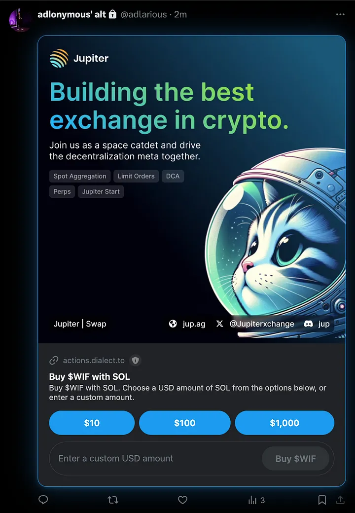

## Introduction

Today, Solana Foundation announced the releases of two innovative specifications — Actions & Blinks. This article is oriented towards non-technical participants in the Solana or any other Blockchain ecosystem with a superficial knowledge of how apps work.

## Actions

An **Action** is an API that returns a Solana transaction to be viewed by the user and signed, and then executed on-chain. The transaction can be sent across various means like a button on a widget or website, QR codes similar to Solana Pay (It is built similar to Solana Pay specs, a look at the docs or codebase might show you that).

Simply put, an Action is an API endpoint that will return metadata and prompts the user to sign with their wallet. It makes it simple for developers to integrate Solana blockchain transactions into their application’s user flow or even allowing users to interact with the blockchain without redirecting them from the app they were using like Twitter, Discord or even right here on Medium (If someone builds a provider for it, more on this later)

### How Actions Work

The Actions API mostly consists of making HTTP requests to an Action URL endpoint and handling the responses that relate to the Action. A GET request returns metadata about what actions are available to the URL and an optional list of related actions, while a POST request returns a signable transaction that will be executed on-chain or on an off-chain service.

#### Action API Flow

The way the flow works is:

- You press a button or link or scan a QR code which prompts the Action Client to send a GET request to the Action Provider.

- The provider responds with metadata and available actions and the client displays a UI with those actions

- You interact with the Action and the client makes a POST request to the Provider with the pubkey you choose

- The provider responds with a custom transaction and the client displays it on the UI

- You approve the transaction and the sign it and the client sends the transaction to the blockchain and voilà!

As you can see, the client handles transaction submission and state management, including necessary validations and error handling. For example, if you want a certain transaction to only last a certain amount of time or be available to certain wallet addresses, actions also support a certain level of invalidation — The GET and POST request may return some metadata that states that the action cannot be executed (with a disabled field)

## Blinks

**Blinks** (short for blockchain links) extend the functionality of Solana Actions by turning them into shareable, metadata-rich links. These links enable clients, such as wallet extensions and bots, to present additional UI options for interacting with Solana Actions directly. Right now, Dialect is the most popular client provider that allows UI client modal rendering.

### Linking Actions with Blinks

A Blink can be linked to an Action in three ways:

- Sharing an explicit Action URL like `solana-action:https://actions.alice.com/donate`. Here, only supported clients (like Dialect) can render the blink and there won’t be a fallback.

- Sharing a link to a website linked to an Action API through an actions.json file on the root of the website.

- Embedding the Action URL into the URL of a Blink provider (like Dialect) — https://blink.to/?action=<action_url>

Here you can see Jupiter’s Blink modal that uses an Action for buying DogWifHat tokens with Solana. The metadata specified in the action like buttons, description, etc. are displayed on the modal. For this to render, you need to download Dialect’s Blink Extension from the Chrome Web Store (Link at the end of the article). But in some cases, if you don’t have the extension installed it displays as a regular link as a fallback, so you can click on it to go to the client webpage with the same modal.

## Uses of Actions & Blinks

Imagine you’re an artist who really like Farcaster frames but wish it was on Twitter as well. Now, you can create a Blink through Dialect linked to an Action that mints an NFT to the user. You post the Blink on Twitter and the client renders the mint page over the tweet similar to the Jupiter swap page. The same applies if you want to create a Donation blink for a charity, a DAO blink to get members of your DAO to vote easily on Twitter or a raffle blink to participate in sweepstakes!

Most importantly, the Actions API helps streamline interacting on-chain to a simple set of HTTPS requests, which makes it easier for Web2 devs to integrate on-chain activity seamlessly into their application and not need to set up a whole token mint page or donation page on their own.

## Important Links

Learn more: [Solana Solutions](https://solana.com/solutions/actions)

Docs: [Solana Docs](https://solana.com/docs/advanced/actions)

GitHub Repo: [Solana Developers](https://github.com/solana-developers/solana-actions)

Dialect Extension: [Chrome Web Store](https://chromewebstore.google.com/detail/dialect-blinks/mhklkgpihchphohoiopkidjnbhdoilof)

