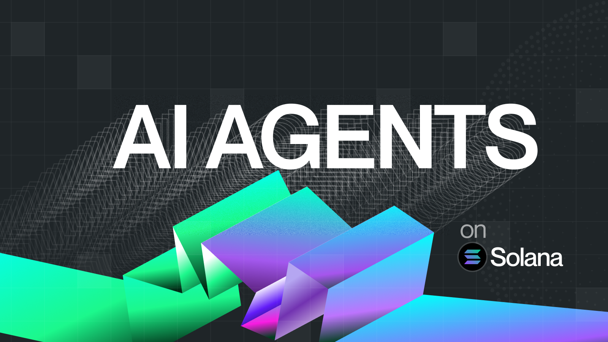
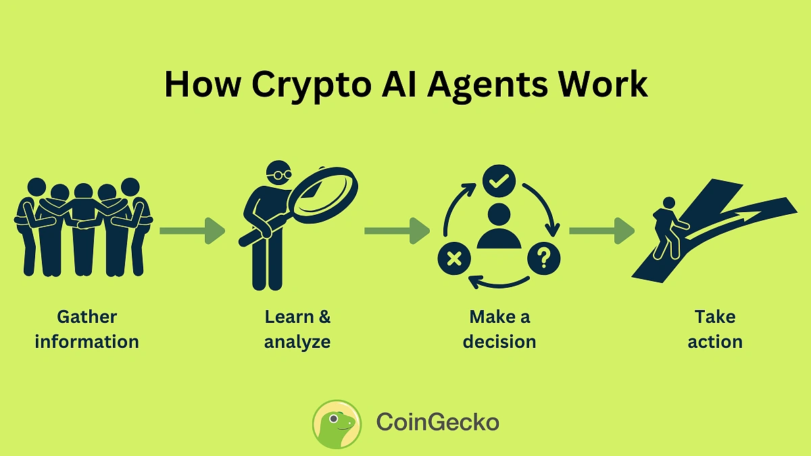

> 🌟 Bài viết này cung cấp cái nhìn tổng quan sinh động về AI agent, công nghệ blockchain. Và sự tích hợp đột phá giữa hai nền tảng tiên tiến này.

## 🌍 Giới thiệu

- **📈 Sự gia tăng** của các AI agent giao dịch trên Solana đã khơi dậy những suy đoán sôi nổi về việc các AI Agent thực hiện các giao dịch tài chính.

- **💰 Thị trường hiện tại** của các token AI đang tạo ra khối lượng giao dịch hơn 1 tỷ USD trong 24 giờ và đại diện cho vốn hóa thị trường vượt hơn 9,5 tỷ USD. Tuy nhiên, vượt ra ngoài các thị trường đầu cơ này, một sự chuyển dịch sâu sắc hơn đã bắt đầu diễn ra trong lĩnh vực tiền điện tử — một sự thay đổi được xây dựng dựa trên nhiều năm tự động hóa ngày càng tăng.

- **🤖 Bot chiếm ưu thế**: Hiện đã chiếm phần lớn các giao dịch tiền điện tử (lên tới 90% trong một số phân khúc). Chúng chưa phải là các AI agent hoàn toàn tự chủ — nhưng chưa hẳn đã không. Dẫu vậy, chúng là những tiền thân rõ ràng, ngày càng trổng quát và độc lập hơn theo thời gian.

- **⚡ Bản chất phù hợp**: Cơ sở hạ tầng tiền điện tử đặc biệt phù hợp với các giao dịch tự động và có tính chương trình hóa.

# 🤖 Tổng quan về AI Agents và những vấn đề liên quan

### 🤖 AI agent là gì?

AI agent là **Smart AI Automation**, tự động thực hiện nhiệm vụ thay con người, dựa trên thuật toán AI. Tự động học hỏi, phân tích, quyết định và tương tác với môi trường, như chatbot, bot giao dịch, hay trợ lý ảo, nổi bật nhờ tính tự chủ và hiệu quả.

### ⛓️ Blockchain và NFTs là gì?

- **Blockchain**: Công nghệ lưu trữ phân tán, lưu trữ dữ liệu trong các khối (block) liên kết, được mã hóa (by chain), đảm bảo tính phi tập trung, minh bạch và an toàn, thường dùng cho tiền điện tử và hợp đồng thông minh.
- **🖼️ NFTs (Non-Fungible Tokens)**: Tài sản số độc nhất trên blockchain, đại diện cho quyền sở hữu vật phẩm như nghệ thuật, âm nhạc, hay đồ trong game.  
  _"NFT giống như Mona Lisa - copy 99.99% vẫn chỉ là bản sao!"_ 😄

---

## ⚖️ Bài toán đặt ra

**Nếu con người ngủ/ngưng hoạt động → Thị trường vẫn chạy**. AI Agent giúp tự động hóa giao dịch nhưng cần giải quyết:

### ✅ Điểm mạnh:

1. **🛡️ Tự chủ (Autonomy)**: Hoạt động độc lập, không cần giám sát liên tục.
2. **⚡ Hiệu quả (Efficiency)**: Kết hợp data on-chain/off-chain để ra quyết định tối ưu.
3. **📚 Khả năng học hỏi (Adaptability)**: Cải thiện qua machine learning.

### ❌ Điểm yếu:

1. **📉 Phụ thuộc dữ liệu**: Hiệu quả giảm nếu data thiếu/sai.
2. **🎨 Thiếu sáng tạo**: Giới hạn trong lập trình.
3. **🔓 Rủi ro bảo mật**: Dễ bị tấn công nếu hệ thống không an toàn.

---

## 🔐 Security Challenge: Bảo vệ Ví Solana

**Vấn đề**: AI Agent cần truy cập ví nhưng lưu **private key** trong code → Rủi ro bị hack!

### 💥 Ví dụ thực tế:

- **3M$ mất trắng** (Banana Gun 9/2024) do lỗi oracle tin nhắn Telegram.
- Bot có quyền ví → Giao dịch không mong muốn không thể đảo ngược.

---

## 🛠️ Giải pháp cân bằng Security & Autonomy

[Turnkey](https://www.turnkey.com/) cung cấp kiến trúc 3 lớp:

### 1. 🔑 Khóa API Phân Quyền

- Giới hạn phạm vi hoạt động của agent
- Định nghĩa chính sách chi tiết (ký giao dịch, tương tác hợp đồng...)

### 2. 🛡️ Môi Trường Enclave (AWS Nitro)

- Cách ly hoàn toàn với bên ngoài
- Không lưu trữ/mạng/khả năng sửa đổi

### 3. ✅ Chứng Thực Công Khai

- Cryptographic proof xác minh mã nguồn
- Reproducible builds đảm bảo tính toàn vẹn

---

## 🚀 Tương Lai Phát Triển

- **🤖 Agent tự chủ hoàn toàn**
- **🎮 Tích hợp GameFi/NFT**
- **🌐 Hệ sinh thái DAO phi tập trung**

## Kết luận:

Sự kết hợp giữa AI agents và NFT collections không chỉ là xu hướng mà còn là một bước tiến quan trọng trong việc mở rộng tiềm năng của công nghệ số. Từ quản lý tự động đến sáng tạo nghệ thuật, AI đang định hình lại cách chúng ta tương tác với NFT, đồng thời tạo ra các cơ hội mới cho nghệ sĩ, nhà sưu tập và nhà đầu tư. Tuy nhiên, các tranh cãi về tính sáng tạo và bảo mật vẫn cần được giải quyết để đảm bảo sự phát triển bền vững.

