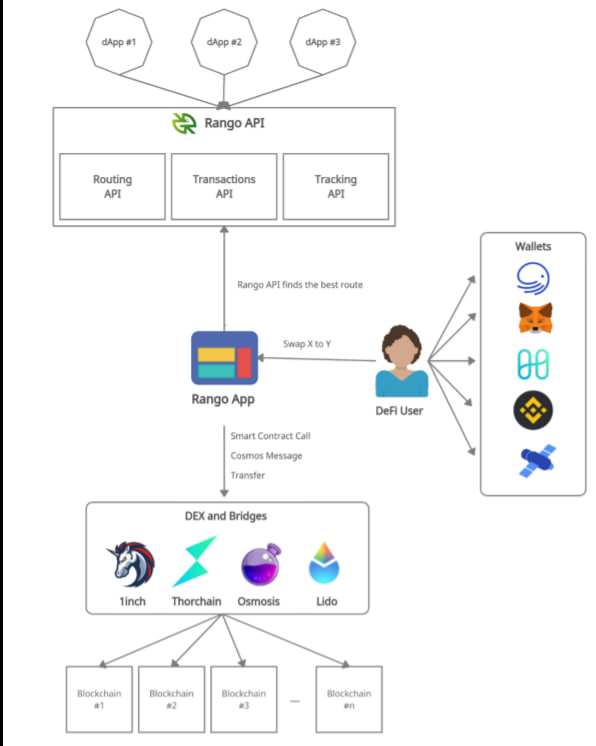
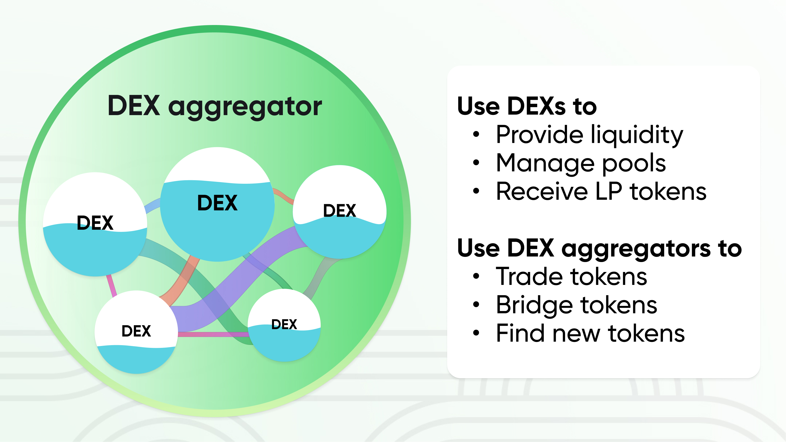
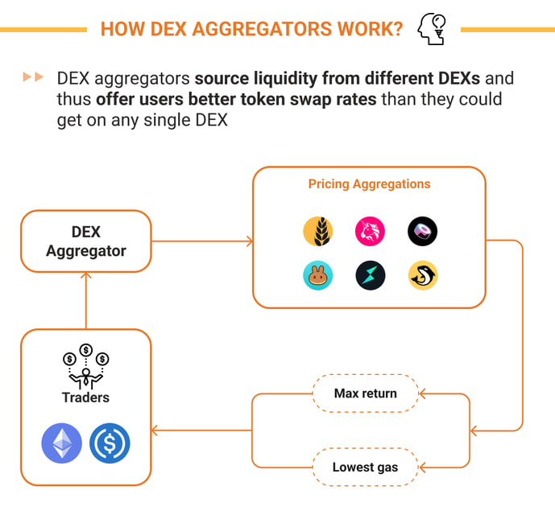
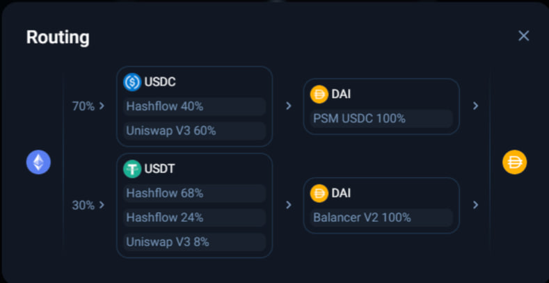
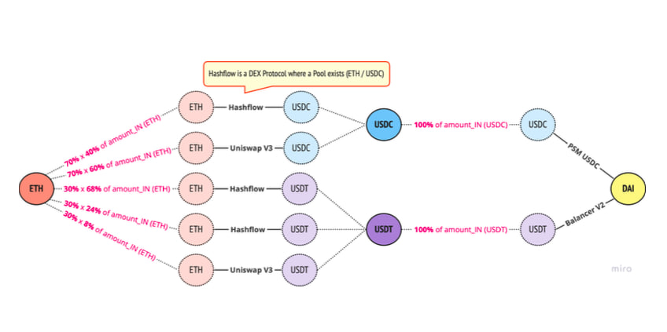

# Tổng quan 🌐 

Nội dung hôm nay sẽ đi sâu về Aggregator (người tổng hợp), thế nên sẽ sơ lược qua một số khái niệm căn bản liên quan tới Aggregator. Và 3 khái niệm chính mà bạn cần biết là DEX, AMM và Aggregator.

## DEX là gì? 🔄

- Bài viết trước mình cũng có nói qua nhưng giờ mình sẽ đi sâu hơn: DEX hay còn gọi là Decentralized Exchange (tạm dịch là Sàn giao dịch phi tập trung) là nền tảng giúp người dùng giao dịch trực tiếp với nhau mà không cần một bên trung gian thứ ba
- Một số ví dụ của DEX dạng này là Trust Wallet (mục DEX), MetaMask (mục DEX), Binance DEX, UniSwap,...
- Sẽ có bài virt61 phân tích cụ thể hơn về khái niệm này

## AMM – Automated Market Maker 🤖

- AMM hay Automated Market Maker (tạm dịch: Đơn vị Tạo lập Thị trường Tự động) là một dạng mới của DEX. Thay vì giao dịch với sổ lệnh như các dạng truyền thống, với AMM, người dùng sẽ giao dịch với các pool thanh khoản.
- Riêng về AMM chắc chắn sẽ có 1 bài viết riêng về thăng này. Vì nó rất hay.

## Aggregator – Đơn vị tổng hợp thanh khoản 🔍

- Cũng vì vấn đề thanh khoản trên hầu hết các DEX chưa ổn định, do đó sẽ xuất hiện thêm nhu cầu cho một dạng sản phẩm mới đó là DEX Aggregator. DEX Aggregator là các đơn vị tổng hợp thanh khoản từ nhiều nguồn khác nhau như từ chính các AMM hay CEX truyền thống.
- DEX Aggregator sẽ có một cơ chế để tối ưu price slippage cũng như phí giao dịch cho người dùng, giúp họ tiện lợi trong việc giao dịch hơn.

***Đây là 1 mô hình đơn giản để dễ hiểu mối quan hệ giữa ba cái này***

## Đặt vấn đề 📝

- Có thể dễ hiểu Một Dex Aggregator điều hướng các pool thanh khoản từ các dex lại pha trộn và tìm ra lợi ích tối ưu nhất cho người dùng. Còn vể tech nó sẽ đươc biểu thị qua đồ thị vô hướng hình hoc Oxy
- Bài toán được biểu diễn thành một đồ thị vô hướng G, trong đó: Giữa 2 cặp đỉnh bất kỳ có thể
   - Hoặc không tồn tại cạnh
   - Hoặc tồn tại 1 cạnh
   - Hoặc tồn tại nhiều cạnh
- Mỗi cạnh được thể hiện bằng một hàm số thuộc Constant Function Market Maker (CFMM)
- Số lượng đỉnh và cạnh trong đồ thị có thể thay đổi (tăng hoặc giảm) theo thời gian do tác động của ngoại cảnh
- Vì tính chất đặc thù của bài toán, cụ thể:
   - Giữa 2 cặp đỉnh bất kỳ có thể tồn tại nhiều cạnh và những cạnh này có thể có hàm số f giống nhau hoặc khác nhau.
   - Cùng giá trị ***amount_IN*** nhưng khi kết hợp với mỗi hàm số f có thể sẽ cho ra giá trị ***amount_OUT*** khác nhau (do tính chất đặc thù của hàm số và một vài biến số trong hàm số có thể thay đổi theo thời gian do tác động của ngoại cảnh)
   - Khi tính giá trị ***amount_OUT*** thì phải chịu một khoản chi phí vận hành (gọi là Network Cost) trong Blockchain

⚡ Ví dụ: Đối với Ethereum Blockchain thì Network Cost gọi là ***Gas Cost***

***Đây là 1 flow swap thông qua công dex aggragator ***

## Mong đợi của bài toán 🎯

### A. Input:
- Cho trước một cặp đỉnh (source, destination) và giá trị "amount_IN" tại đỉnh source.

### B. Output:
- Mong muốn tìm path sao cho thoả mãn Option ⇒ path có thể chứa
   - Hoặc 1 route ⇒ nếu không split "amount_IN" tại đỉnh source
   - Hoặc nhiều route ⇒ nếu split "amount_IN" tại đỉnh source và mỗi % split "amount_IN" sẽ phải tương ứng với outgoing edge khác nhau của đỉnh source

Ví dụ:

> 🌟 Bài viết tiêp theo sẽ tìm hiểu sâu hơn về thuật ngữ AMM.

