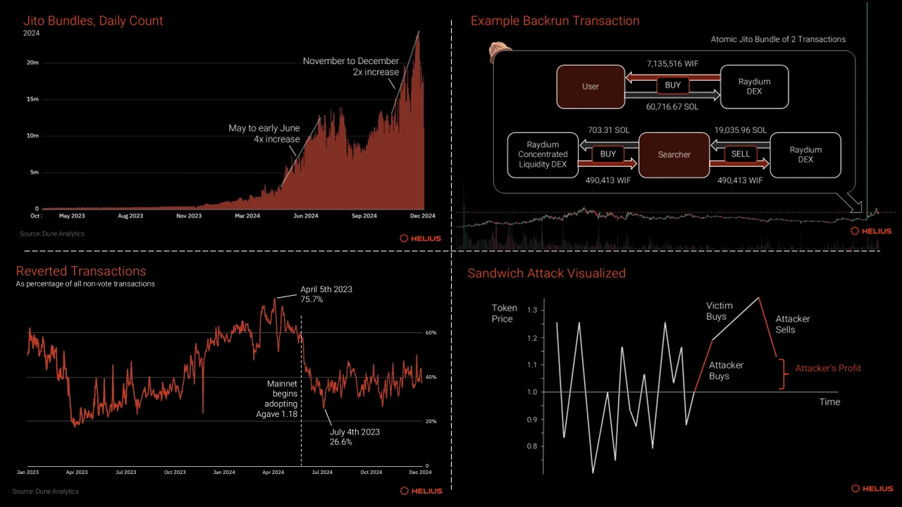
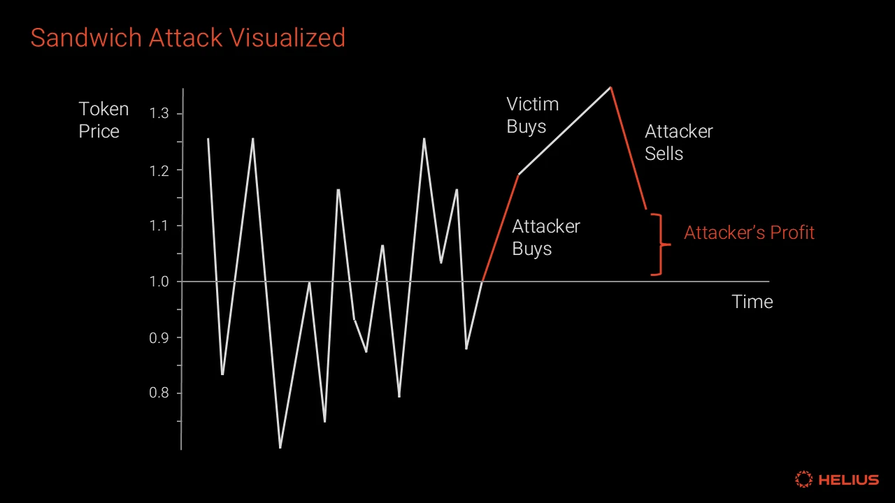
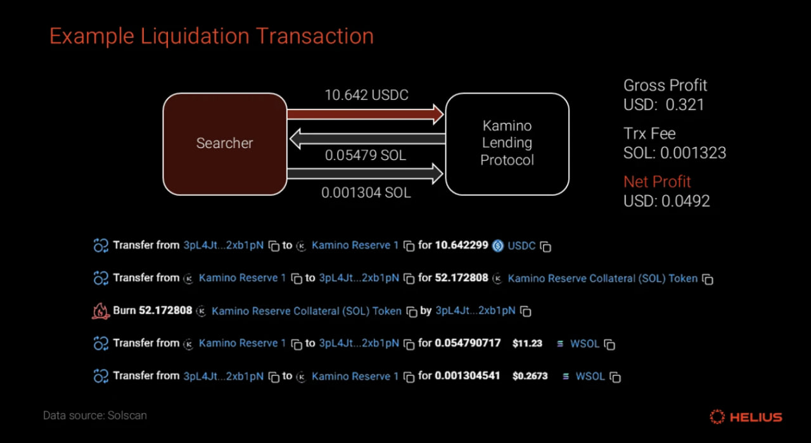
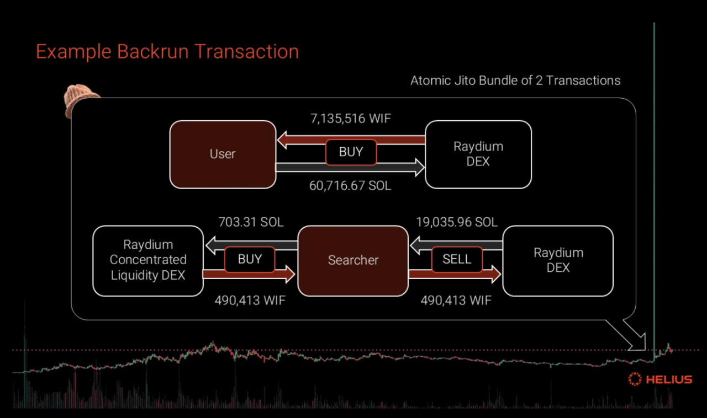
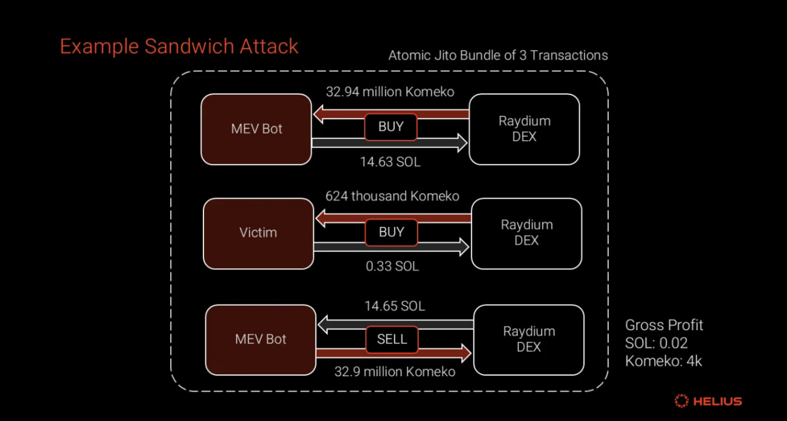

> This article describes a MEV attack in more detail for engineer.

## Introduction

# Summary of MEV on Solana and related issues:

### MEV Characteristics on Solana:

Different from other blockchains due to unique architecture and lack of global mempool
Requires independent mempool development and network-wide adoption

### Current Situation:

Jito suspended public mempool in March 2024, reducing harmful MEV
Alternative mempools emerged with less transparency
DeezNode operates a private mempool and is the main source of sandwich attacks
DeezNode's bot executed 1.55 million sandwich transactions in 30 days, profiting 65,880 SOL

### Affected Groups:

Memecoin traders vulnerable to sandwich attacks due to high slippage tolerance
Marinade Finance's SAM criticized for enabling validator sandwiching

### Key Statistics:

Over 3 billion Jito bundles processed in the past year
90.4 million successful arbitrage transactions
Average profit per arbitrage: $1.58
Total profits: $142.8 million (88.7% in SOL)

### Proposed Solutions:

Validator whitelists (considered last resort)
Sandwich-resistant AMMs (sr-AMMs)
Multiple Concurrent Leaders (MCL) - long-term solution under development

## Introduction

Here's a concise summary of MEV:

1. Basic MEV Definition:

- MEV (Maximal Extractable Value) involves extracting value by manipulating transaction order
- Transactions can be added, removed, or reordered within blocks
- Searchers monitor chains to strategically place trades for value extraction

2. MEV on Solana:

- Functions differently due to unique architecture and no global mempool
- Uses features like Turbine and Stake-Weighted QoS
- Fast block production limits traditional MEV approaches
- Searchers need own nodes or validator partnerships

3. Understanding MEV:

- Term has varied interpretations
- Not all MEV is harmful
- Complete elimination is considered unlikely
- Networks claiming MEV elimination often lack activity or use questionable solutions

4. Sandwiching:

- Most prominent and harmful form of MEV
- Involves placing transactions before and after target transaction
- Profitable for searchers but increases costs for regular users
- Negatively impacts execution prices

## MEV Process

### This report analyzes Solana’s current MEV (Maximal Extractable Value) landscape and is divided into four sections:

1. **Forms of MEV**: Explores the various types of MEV observed on Solana today, supported by detailed examples.
2. **MEV Mitigation Mechanism**s: Examines strategies and mechanisms aimed at reducing or eliminating harmful forms of MEV.

### **_Forms of MEV_**

### Liquidations

When borrowers on lending protocols don’t maintain the required collateralization ratio, their loans can be liquidated. Searchers track these undercollateralized positions on the blockchain, repaying the debt to claim part of the collateral as a reward. This liquidation process, seen as good MEV, is vital for protocol solvency and supports the stability of the on-chain DeFi ecosystem.

### Example:

On December 10, a liquidation took place on Kamino, Solana’s top lending protocol.

- A searcher paid 10.642 USDC to settle a user’s debt, receiving 0.05479 SOL in collateral.
- After paying a 0.0013 SOL protocol fee and a 0.001317 SOL priority fee,
- The searcher earned a net profit of 0.0492 USD.

### Front-running

- **Front-running Defined**: An MEV searcher spots a trader’s order in the mempool and places a matching order first, profiting from the price shift.
- **Mechanism**: They act on an unconfirmed transaction’s price impact before it’s processed.
- **Simplicity**: Unlike sandwich attacks, it’s a straightforward strategy.
- **Process**: The searcher buys before a target’s price-boosting order, bundling their transaction to go first.
- **Profit**: They gain as the target’s trade raises the price.
- **Target’s Loss**: The trader pays more due to the searcher’s earlier buy.

### Back-runing

Back-running, an MEV strategy opposite to front-running, exploits temporary price imbalances from a user’s transaction, often due to poor routing. After the transaction, searchers trade the same asset to balance prices across pools, earning a profit that the user could have gained with better execution.

#### Example

- **Event Overview**: On January 10, 2024, a user bought $8.9 million worth of DogWifHat (WIF) in one transaction.
- **Market Context**: WIF traded at $0.2 with only a few million dollars in liquidity across all on-chain venues.
- **Transaction Execution**: The Jupiter aggregator split the trade across three pools with limited liquidity, causing a price spike to $3.
- **Back-run Execution**: A searcher used a Jito Bundle, paying a 890.42 SOL ($91,621) tip for priority.
- **Step 1 - Purchase**: The searcher swapped 703.31 SOL ($72,368) for 490,143.90 WIF via a Raydium concentrated liquidity pool.
- **Step 2 - Sale**: They then traded the WIF tokens for 19,035.97 SOL ($1,958,733) through a Raydium V4 pool.
- **Profit Outcome**: The back-run netted a profit of 17,442.24 SOL ($1,794,746) in one transaction.
- **Note**: All dollar values reflect prices at the time of the transaction.
  

### Sandwich Attacks

- **Sandwich Attacks Defined**: The most infamous toxic MEV, targeting traders on AMMs or bonding curves with high slippage tolerances.
- **Trader Vulnerability**: Memecoin traders, chasing high returns, set high slippage for fast execution on illiquid, volatile assets, making them prime targets.
- **Impact on Traders**: Sandwiching forces traders to fill orders at the worst possible price, creating a negative outcome.
- **Attack Process**:
  - Step 1 - Front-run: The attacker buys the asset unprofitably, pushing the price to the victim’s slippage limit.
  - Step 2 - Victim’s Trade: The victim’s order executes at this high price, further inflating it.
  - Step 3 - Back-run: The attacker sells profitably at the elevated price, offsetting losses and earning a net profit.
- **Execution**: All three transactions are bundled atomically for success.

#### Example Sandwich Attack Transaction

**Event Overview**: A Sandwich attack occurred on December 16, 2024, via a known program (vpeNALD… Noax38b), executed as an atomic Jito bundle with a 0.000148 SOL ($0.03) tip. - **Front-run Transaction**: Searcher spent 14.63 SOL to buy 32.9 million Komeko tokens, a new meme coin on Pump Fun. - **Victim Transaction**: Victim swapped 0.33 SOL for 624,000 Komeko tokens. - **Back-run Transaction**: Searcher sold 32.9 million Komeko tokens for 14.65 SOL.

### **_MEV Mitigation Mechanism_**

Substantial resources are dedicated to studying and integrating general-purpose, out-of-protocol mechanisms into applications and infrastructure to mitigate or reallocate MEV and reduce its on-chain surface area.

### Validator Whitelists

- **Proposed Idea**: Stakers, RPC providers, and validators could ostracize sandwiching validators by skipping their leadership slots.
- **Downsides**: Whitelists, a last-resort option, could delay transactions by seconds, harming user experience.
- **Risks**: This risks a semi-permissioned, censored system, clashing with blockchain’s decentralized principles, and might exclude honest validators, eroding trust.
- **Alternative**: Independent developers and apps can create their own validator allow/deny lists using the Helius Node.js SDK’s sendTransaction method.

### Dynamic Slippage + MEV Protection

- **Slippage Management Challenges**: Traditionally, users manually adjust slippage, a tedious task, especially for volatile or illiquid tokens like memecoins, where settings differ from stable assets.
- **Jupiter’s Solution**: In August 2024, Jupiter Aggregator on Solana introduced dynamic slippage, an algorithm that adjusts slippage in real-time using heuristics based on:
  - Market conditions
  - Token types (stable vs. volatile)
  - Trading pools or order books
  - User’s slippage tolerance
  - Goal: Optimize trades with minimal slippage, reducing MEV opportunities.
- **MEV Protect Mode**: A feature in DEXs and Telegram bots routes trades to Jito block engines to prevent sandwich attacks, though it increases fees.
  - **User Behavior**: Many Telegram bot users skip MEV protection, favoring speed over safety.

## Conclusion

- **Solana MEV Evolution**: Solana’s MEV landscape is rapidly changing, not yet at a stable equilibrium.
  - **Searcher Trends**: Searchers are advancing strategies to extract value.
  - **Ecosystem Response**: A multipronged approach uses infrastructure and mechanisms to curb harmful MEV.
- **Investor Outlook**: Firms like Multicoin Capital are investing, expecting ecosystem teams to capture more MEV value, with a shifting distribution in the future.

## Further Resources

- MEV an Introduction - Helius blog
- Arbitrage as a Convex optimization problem - Umberto Natale, Chorus One
- Ethereum & Solana: MEV & Beyond - Uncommon Core

