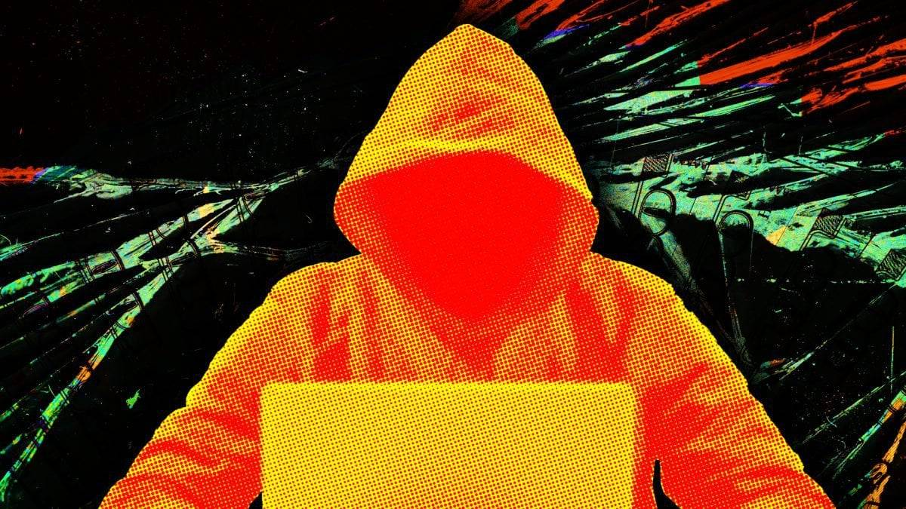
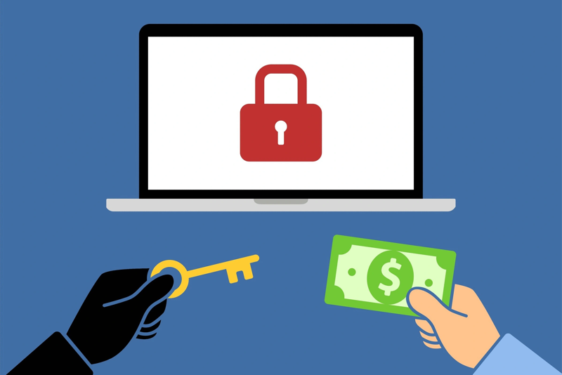

# 🔐 4 Lần Tôi Bị Hack Ví Như Thế Nào?

Đây là một blog không viết về tech, nhưng cũng là trải nghiệm cá nhân mình trong quá trình làm việc cũng như đầu tư trong mảng blockchain. Đây là một số bài học cá nhân mình nhận ra và mọi bài học đều phải trả bằng tiền 😢. Giờ thì đi sâu vào những câu chuyện thôi. Let's go.

## Một số keyword để dễ hiểu khi đọc bài viết: 
- **1.CEX**: Sàn tập trung, trung gian quản lý ví (vd: Binance).
- **2.DEX**: Sàn phi tập trung, tự quản lý ví (vd: Uniswap).
- **3.Mnemonic**: Chuỗi từ khôi phục ví (12/24 từ).
- **4.Onchain**: Hoạt động trực tiếp trên blockchain.
- **5.Ethereum Explorer**: Công cụ tra cứu giao dịch Ethereum (Etherscan).
- **6.EVM**: Máy ảo chạy smart contract trên Ethereum.
- **7.Polygon**: Layer2 của ETH là 1 blockchain nhanh, rẻ, hỗ trợ Ethereum.
- **8.Wallet**: Ví lưu trữ crypto (Metamask, Ledger).
- **9.Dapps**: Ứng dụng phi tập trung trên blockchain.
- **10.Crosschain**: Chuyển tài sản giữa các blockchain.
- **11.Sign Transaction**: Ký xác nhận giao dịch bằng khóa riêng.
- **12.Gas**: Phí giao dịch trên blockchain.
- **13.Airdrop**: Phát token miễn phí.
- **14.Smart Contract**: Code tự động trên blockchain.
- **15.Memecoin**: Coin dựa trên meme (Dogecoin).
- **16.Chain**: Blockchain (Ethereum, Polygon).
- **17.Swap**: Đổi token (ETH sang USDT).
- **18.Integrate**: Kết nối với hệ thống (ví với Dapp).

## 💥 Lần Thứ Nhất: (06-2022) (Token bị hack là MATIC và ETH)

- 🔍 Để mà nói thì đây là khoảng thời gian đầu mình bước vào lĩnh vực blockchain nói chung và thị trường crypto nói riêng, thời gian này kiến thức về blockchain và crypto của mình khá sơ khai. Căn bản lúc đó mình làm việc chỉ là bề nổi li ti trên thị trường, biết một chút về cách chuyển token từ sàn CEX (1) qua DEX (2) và ngược lại. Đây cũng là kiến thức vô cùng căn bản và quan trọng. Khi đấy hình dung của mình về thị trường và tính bảo mật của thị trường còn khá ngây ngô và đơn giản.
- 📝 Thời điểm này cách lưu trữ ví <mnemonic (3): 12 ký tự> của mình chủ yếu là viết trong 1 file Word 😅 Giờ mà nghĩ lại thật là buồn cười. Mình cũng có nghe qua một số lời khuyên nên take note ra giấy nhưng khi đó mình làm việc trên onchain(4) thường không nhiều nên mình cũng không chú ý lắm.
- 🖥️ Và một ngày đẹp trời đến, nói thêm nữa là khi đó mình xài máy tính Windows (unsafe on blockchain). Mình đã install 1 phần mềm edit video (Camtasia Studio) nhờ đươc 1 thằng bạn thân tên Nhân lùa, tý tag nó luôn 😅. Dĩ nhiên đó là bản crack 😅 bởi nghèo mà. Và sau đó thật thú vị khi máy tính mình lag như chưa từng được lag 😂. Mình nhớ là thời điểm này ví vẫn chưa bị hack, có thể 1 vài nguyên nhân nào đó về tech từ hacker.
- 🔄 Sau đó, quyết định đầy "thông minh" của mình là cài đặt lại Win và mình đã upload file Word chứa mnemonic lên Google Drive. Khi đó trong ví mình có khoảng 3 Matic (hiện tại Matic đổi thành POL), ~ giá trị tầm 3$. Vì giá trị không lớn nên mình cũng không để ý (lúc này là hacker đã lấy được 12 ký tự mnemonic thông qua việc upload file Word lên Google Drive và rút 3 Matic, nhưng mình không biết).
- 💸 Vào khoảng 1 tuần sau ( cuối tháng 07/2022) mình có chuyển 1 lượng ETH vào ví này để lưu trữ và "đùng" sau khi vừa thấy ETH hiện trong ví Metamask, thì khoảng 1s sau lượng token đó biến mất.
- 😱 Khi đấy mình còn nghĩ do network lag và mình đợi 1'-2' vẫn không thấy đâu. Thì khi check trên Ethereum explorer (5), mình thấy token đó đã chuyển qua 1 ví khác. Ố dề luôn, thẫn thờ 1 tý thì mình check lại toàn bộ các transaction trên toàn bộ các chain của EVM (6), và mình phát hiện ra ví của mình đã bị hack trên chain Polygon(7) hơn 1 tuần rồi, mợt mõi mà. Thế là đóng máy rồi một nụ cười tươi, cài Win lần nữa và không quên bye bye cái ví vừa bị hack 😅

* NOTE: *** các ví mà đã bị auto rút tiền mà mình k can thiệp nghĩa là mình đã mất ví. không còn cách nào lấy lại đươc nhé ***

⚠️ **Bài học trong vụ hack này là đừng bao giờ cài phần mềm crack và lưu trữ ví trên file Word. Đặc biệt là hạn chế dùng Windows laptop nếu bạn đang join vào thị trường crypto.**

## 🔥 Lần Thứ 2: (09/2023) (Token bị hack là STG + USDC)

- 📄 Sau vụ hack lần 1, mình đã rút ra bài học đầy sâu sắc là viết 12 ký tự (mnemonic) vào giấy liền 😅 Mình cảm thấy nó thật sự an toàn. Chỉ có điều mỗi lần muốn import vào wallets(8) thì hơi mất thời gian xíu, bên cạnh đó, mình cũng đã không sử dụng máy Windows khi làm việc với blockchain.
- 📚 Thời điểm này kiến thức về blockchain và crypto của mình đã được củng cố đi rất nhiều. Nên mình cũng khá tự tin về việc thao tác với các Dapps(9), hoặc chuyển tiền trên các crosschain(10) hiện tại. Nói chung khi đó là bố của tự tin luôn, ai cần là chỉ rẹc rẹc 😂. Thao tác trên onchain của mình khi đó là master luôn rồi. Từ việc sign transaction(11), đến confirm hầu như các message nếu đã decode thì không sao, không decode mình tự decode luôn. Có 1 lần mình từng suýt nữa confirm 1 message approve unlimited token. Nhờ có kiến thức vững nên mình đã đọc kỹ message và tránh được 1 vụ hack. Đó là lý do mình tự tin không sợ thằng hacker nào 😎
- 🍻 Thời điểm này mình cũng có join vào 1 số dự án freelance về Web3, và 1 ngày đẹp trời mình đi trip cùng với team, trong lúc vui mình uống vài lon làm lân lân cái đầu và sau đó về phòng mở máy ra làm việc. Thì có 1 thằng bên USA nhắn trên platform freelance bảo cần mình hỗ trợ fix bug trên Dapps của hắn với 1 khoản budget cũng ngon. Trước đó thì mình đã làm nhiều dự án rồi, nên lần này cũng như mọi lần khác. Click vào link Bitbucket clone resource về và theo từng step thằng đó gửi qua để chạy source.
- ⚡ Trong cơn lân lân, chill chill 😂. Mình install 1 số lệnh nó gửi, căn bản là lệnh khá lạ. Nhưng khi đó mình vẫn chủ quan. Đến khi MacBook mình hiện 1 số alert kiểu hệ thống, là mình kịp nhận ra source này không ổn. Thì ngay lập tức mình đã ngắt kết nối, và remove source ra khỏi máy. Check lại toàn bộ ví và đùng, mọi thứ vẫn an toàn, chẳng mất gì cả. Khi đó mình cũng khá bình tĩnh vì dù gì các ví đang active trên wallet hầu như cao nhất cũng 3-10$ (chủ yếu để làm gas(12)). Mình nghĩ nếu bị hack rồi thì hacker nó cũng không chê 3$ đâu. Lần đầu 3$ MATIC nó còn bào được mà 😂 Nên là mình chủ quan không clean máy.
- 😓 Dĩ nhiên, điều gì đến cũng đến. Sau đó khoảng 15 ngày mình có nạp 1 lượng token STG để làm airdrop(13). Thì mọi thứ vẫn diễn ra khá suôn sẻ, cho đến khi hoàn thành các thao tác mình tắt máy và sáng hôm sau mở lên thì lượng STG và 1 ít USDC đã bị mất 🥲 Lần này giá trị mất không bằng lần đầu. Nhưng mình cay cú là sao mình có thể bị mất được. Kiến thức cũng nắm khá vững rồi mà. Nhưng đâu lại vào đó. Lại thẫn thờ tý và tiếp tục bỏ cái ví đó 😔

⚠️ **Bài học rút ra: Khi có 1 hành động nào thấy bất thường trên máy thì ngay lập tức phải chuyển toàn bộ token của toàn bộ ví về 1 ví mới hoàn toàn và reset lại máy. Cái thông minh của hack ở đây là họ không rút tiền nhỏ lẻ mà đợi khi wallet có giá trị 1 khoảng nhất định con bot mới bắt đầu rút tiền. Tiếp tục 1 bài học xương máu 😞 Đặc biệt là đừng có hành động gì khi đang say, hậu quả khôn lường 🤦‍♂️**

## 📉 Lần Thứ 3: (10/2024) (Token bị mất là Base ETH)

- 🧩 Riêng lần này mình muốn kể ngắn gọn xíu tại vì nó liên quan tới smart contract(14) (tech). Thì căn bản là thường trên DexScreener (platform tổng hợp các meme token) luôn hiển thị lượng token top volume mỗi ngày. Và thỉnh thoảng mình sẽ dành 1 lượng token bên Base chain để mua bán memecoin(15) trên chain(16) này. Dĩ nhiên lượng giá trị mua meme là không nhiều. Thì trong lúc đó mình thấy 1 số lượng meme coin mới tạo có volume cao. Nên mình đã swap(17) 1 meme coin. Và đùng trong khi đã mất ETH nhưng token mình mua không chuyển về ví. Sau khi kiểm tra trên explorer mình thấy đây là 1 token scam.
- Hình thức hack này là hack thông qua smart contract. Những bài viết sau này mình sẽ đi sâu hơn phân tích nguyên nhân của vụ hack này hơn.
- 🚨 Và phải nói token scam hiện nay có nhơn nhởn trên blockchain, tập trung chủ yếu vào memecoin. Nói sâu process hack lần này thì cơ bản là: Mình đặt token scam đó là A. Token A này mình mua thông qua Uniswap V3 dex. Thì token A đã chuyển vào ví mình, nhưng sau đó 1s nó sẽ tự chuyển vào lại smart contract của token. Kiểu đi chợ đưa tiền mua bó rau, mình đưa tiền xong thì bà bán rau đưa mình chạm vào bó rau ngửi lấy mùi 1 cái, rồi bả giựt lại á. Trong đời thường thì mình lấy lại được liền bó rau đó. Nhưng trên blockchain thì không bao giờ nha 😭
- 🔍 Lần này ví mình không bị hack, mà hack ở đây là mua nhầm token scam. Và đây cũng chỉ là 1 trong những loại token scam trên thị trường thôi. Hiện nay thì có 1 số trang có thể check được tính hợp lệ của token. Nên trước khi swap token nào đó, có thể copy contract để check trước đảm bảo an toàn.

⚠️ **Bài học rút ra: Trên thị trường DEX thì luôn luôn check trước contract trước khi integrate(17) với contract đó. Thế thôi.**

## 🤦‍♂️ Lần Thứ 4: (12/2024) (Token bị mất là Wormhole)

- 😅 Lần này có lẽ là lần đặc biệt nhất, vì chính mình tự hack mình 😂. Nói vui thế thôi, nhưng câu chuyện vẫn là bảo mật. Căn bản nếu 1 ai đó chọn lưu trữ tài sản trên onchain thì thường họ có khoảng 3-4 ví là đủ lưu rồi. Tương đương với việc họ phải lưu 3-4 mnemonic.
- 📱 Còn mình thì vừa lưu trữ và vừa làm việc nên số lượng ví mình tiếp xúc mỗi ngày có thể lên tới hàng chục ví. Và dĩ nhiên các ví mình lưu trữ luôn riêng biệt ghi bằng giấy bút. Câu chuyện mình muốn nói ở đây là các ví làm việc hoặc làm airdrop. Thì thường mình sẽ vẫn lưu trữ ví qua iCloud. Dĩ nhiên là có nhiều lớp bảo vệ (3-4 lớp) cá nhân của mình để ví dụ iCloud bị hack, thì hacker cũng không dễ gì lấy được những ví đó của mình. Chuyện đến đây thì nói chung là hoàn hảo, an toàn tuyệt đối.
- 😱 Nhưng 1 ngày vẫn rất là đẹp trời, mình chuyển lượng token Wormhole của mình qua 1 ví mới để tối ưu airdrop. Và 1 thao tác ố dề được ghi chú là copy mnemonic mới đặt tên là: stake Wormhole 2. Mọi thứ vẫn chưa có gì cho đến khi mình nghĩ mình vô tình paste mnemonic ví mới vào ví cũ: stake Wormhole 1. Và không để ý sự khác biệt (do trong list có quá nhiều mnemonic). Thì gần đây mình reset lại máy. Mình nghĩ mọi thứ đã an toàn rồi thì ố dề lần nữa, sao 2 ví stake Wormhole lại giống nhau mnemonic 😭. Mà đặc biệt hơn ví cũ đã được Wormhole airdrop cho 1 lượng token khá khá. Vào ngày 14-4 mình dự định sẽ claim các token này. Và thế là mình vừa giúp Wormhole burn được 1 lượng token 🥲 Oh shit man 😢, giỡn mẹt hả 😭

⚠️ **Bài học rút ra: Dùng ít ví lại, dùng nhiều quá sẽ bị lú luôn. Cái này là tự mình hack mình đúng nghĩa đen 😅**

<!--  -->

## 📌 Tổng Kết

Sau 4 lần mất tiền này thì chẳng còn gì để nói hơn nữa. Mình vẫn còn phải học dài dài về sự cẩn thận hơn, an toàn hơn trong việc bảo vệ ví trên onchain. Với những ai không rành về công nghệ thì thôi đừng nên qua onchain luôn cho đỡ đau đầu.

Và bạn có thể thấy rằng căn bản của mọi công nghệ đều phụ thuộc vào chính con người. Lần lượt các lần hack nguyên nhân đi từ kém công nghệ => sự bất cẩn. Nói chung là cạn phước lắm mới dùng onchain đó mà (just kidding 😅).

Blog này kết thúc tại đây, hy vọng những bài học của mình sẽ giúp bạn tránh khỏi những tổn thất không đáng có trong blockchain. Hôm nay đi nhậu cái cho đỡ buồn. Vừa viết blog vừa khóc 😢

